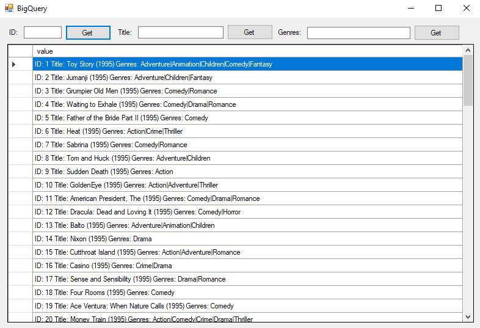

# BigQuery Sandbox C# Windows Application
 
C# windows application to access Google BigQuery online database. BigQuery Sandbox only allow to use Select command because of that I did only Select implemantation.

Google BigQuery çevrimiçi veritabanına erişmek için C# windows uygulaması. BigQuery Sandbox, yalnızca Select komutunun kullanılmasına izin verdiğinden, yalnızca Select uygulamasını yaptım.

  

I use 100.000 datas from movies.csv. To get datas <a>https://grouplens.org/datasets/movielens/</a>

If you want to run app, you need to change directory <strong>System.Environment.SetEnvironmentVariable("GOOGLE_APPLICATION_CREDENTIALS", "D:/İndirilenler/key.json");</strong> from this line for every event function.
